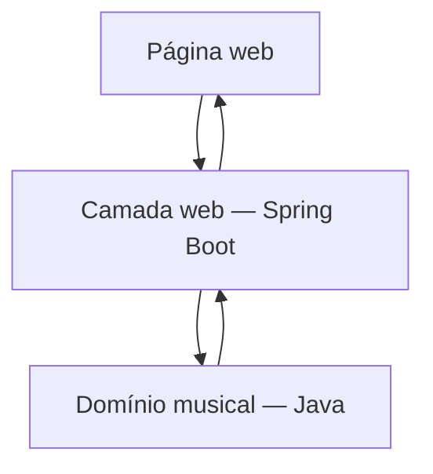

# Gerador de Escalas Musicais

Documento curto de definição inicial da POC. Este texto serve como visão arquitetural e pode evoluir para o README do projeto.

## Objetivo
Criar uma aplicação web em Java que receba uma tônica e um tipo de escala e apresente suas notas com grafia musical correta.

## Primeira versão
- aplicação web executada localmente;
- seleção da tônica;
- geração apenas da escala maior;
- grafia correta de sustenidos e bemóis;
- interface HTML simples;
- sem banco de dados;
- sem login;
- sem hospedagem;
- sem React ou outro framework de front-end.

## Definição de pronto
O usuário abre a página, escolhe uma tônica maior, clica em “Gerar escala” e recebe as oito notas da escala com grafia musical correta.

### Exemplos obrigatórios
```text
F  -> F - G - A - Bb - C - D - E - F
F# -> F# - G# - A# - B - C# - D# - E# - F#
Gb -> Gb - Ab - Bb - Cb - Db - Eb - F - Gb
```

## Arquitetura inicial
A decisão arquitetural fundamental desta POC é que as regras musicais não podem depender da página, do navegador nem do Spring Boot. O domínio musical deve poder ser testado isoladamente e reutilizado futuramente.



## Escopo de evolução
Depois desta definição, a sequência prevista é:
1. criar o repositório Git;
2. gerar o projeto Spring Boot com Maven, Java 25 e Spring Web;
3. implementar primeiro o domínio musical;
4. conectar o domínio à página web;
5. adicionar o primeiro teste automatizado.

Esta versão não é uma especificação final. A arquitetura será refinada conforme surgirem decisões reais durante a implementação.

Criado em 22/07/2026