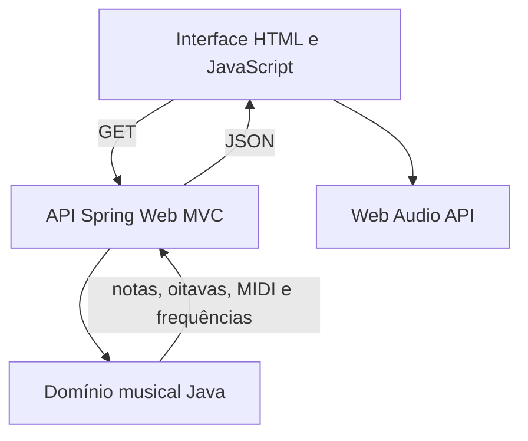

# Gerador de Escalas Musicais

Aplicação web em Java para gerar, visualizar e ouvir escalas musicais com grafia correta de sustenidos e bemóis.

## Funcionalidades

- geração de escalas maiores;
- geração de escalas menores naturais;
- geração de escalas menores melódicas ascendentes;
- geração de escalas menores harmônicas;
- suporte às 21 grafias de tônica natural, sustenida ou bemolizada, de `C` a `B`;
- manutenção da sequência correta das letras musicais em cada grau;
- uso automático de sustenidos, bemóis, sustenidos duplos e bemóis duplos quando necessários;
- apresentação das oito notas, incluindo a repetição da tônica na oitava seguinte;
- cálculo da oitava, do número MIDI e da frequência de cada nota;
- reprodução sequencial da escala no navegador pela Web Audio API;
- escolha entre timbres sintetizados de piano e violino;
- controle de volume e interrupção da reprodução;
- API HTTP para integração com outros clientes;
- validação de tônicas inválidas com resposta HTTP `400 Bad Request`;
- interface responsiva, sem framework JavaScript e sem banco de dados.

Exemplos de grafia produzida:

```text
F maior   -> F - G - A - Bb - C - D - E - F
F# maior  -> F# - G# - A# - B - C# - D# - E# - F#
Gb maior  -> Gb - Ab - Bb - Cb - Db - Eb - F - Gb
G# maior  -> G# - A# - B# - C# - D# - E# - F## - G#
A menor   -> A - B - C - D - E - F - G - A
Am melódica -> A - B - C - D - E - F# - G# - A
Am harmônica -> A - B - C - D - E - F - G# - A
Bb menor  -> Bb - C - Db - Eb - F - Gb - Ab - Bb
```

## Tecnologias

- Java 25;
- Spring Boot 4.1;
- Spring Web MVC;
- Maven Wrapper;
- HTML, CSS e JavaScript;
- Web Audio API;
- JUnit 5.

## Como executar

Pré-requisito: JDK 25 instalado e disponível no `PATH`.

No Windows, abra o PowerShell na raiz do projeto e execute:

```powershell
.\mvnw.cmd spring-boot:run
```

No Linux ou macOS:

```bash
./mvnw spring-boot:run
```

Se você já possui o Maven instalado, também pode executar:

```bash
mvn spring-boot:run
```

Depois, acesse [http://localhost:8080](http://localhost:8080). Para encerrar a aplicação, pressione `Ctrl+C` no terminal.

## Como usar

1. Selecione a tônica.
2. Escolha entre a escala maior, a menor natural, a menor melódica e a menor harmônica.
3. Clique em **Gerar escala**.
4. Para ouvir as notas em sequência, escolha o timbre, ajuste o volume e clique em **Ouvir escala**.
5. Use **Parar** para interromper a reprodução.

O som é sintetizado pelo navegador e, portanto, depende do suporte à Web Audio API.

## API HTTP

### Escala maior

```http
GET /api/escalas/maior?tonica=F%23
```

### Escala menor natural

```http
GET /api/escalas/menor-natural?tonica=Bb
```

### Escala menor melódica

```http
GET /api/escalas/menor-melodica?tonica=A
```

A escala menor melódica é gerada em sua forma ascendente, com sexta e sétima maiores. A forma descendente tradicional corresponde à menor natural.

### Escala menor harmônica

```http
GET /api/escalas/menor-harmonica?tonica=A
```

A escala menor harmônica mantém a sexta menor e eleva o sétimo grau em relação à menor natural.

A tônica pode ser natural (`C`), sustenida (`C#` ou `C♯`) ou bemolizada (`Cb` ou `C♭`). Em URLs, caracteres especiais devem ser codificados; por exemplo, `#` corresponde a `%23`.

Exemplo de resposta, com alguns valores abreviados apenas para leitura:

```json
{
  "tonica": "A",
  "notas": [
    {
      "nome": "A",
      "oitava": 4,
      "midi": 69,
      "frequencia": 440.0
    },
    {
      "nome": "B",
      "oitava": 4,
      "midi": 71,
      "frequencia": 493.8833012561241
    }
  ]
}
```

Cada nota contém:

- `nome`: grafia musical da nota;
- `oitava`: oitava científica utilizada na reprodução;
- `midi`: número da nota no padrão MIDI, entre 0 e 127;
- `frequencia`: frequência em hertz, calculada com `A4 = 440 Hz`.

As escalas geradas pela API começam na oitava 4 e avançam de oitava ao atravessar a nota C.

## Testes

Execute a suíte automatizada com:

```powershell
.\mvnw.cmd test
```

No Linux ou macOS, use `./mvnw test`. Os testes cobrem:

- grafia de escalas maiores, menores naturais, menores melódicas e menores harmônicas;
- acidentes simples e duplos;
- equivalência enarmônica;
- cálculo de altura, MIDI, oitava e frequência;
- validação de entradas;
- respostas da camada web;
- inicialização do contexto Spring Boot.

## Arquitetura

As regras musicais ficam isoladas da interface e do Spring Boot. A camada web converte a tônica recebida, seleciona o gerador apropriado e fornece à interface os dados necessários para exibição e reprodução.



Estrutura principal:

```text
src/
├── main/
│   ├── java/br/com/geradorescalas/
│   │   ├── dominio/   # notas, acidentes e geração de escalas
│   │   └── web/       # endpoints HTTP
│   └── resources/
│       └── static/    # interface web
└── test/              # testes de domínio, web e integração
```

O projeto não exige banco de dados, login, serviço de áudio externo ou processo separado para o front-end.
